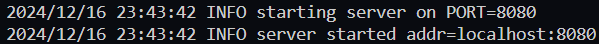
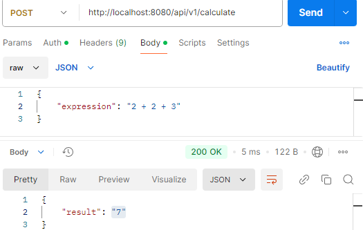
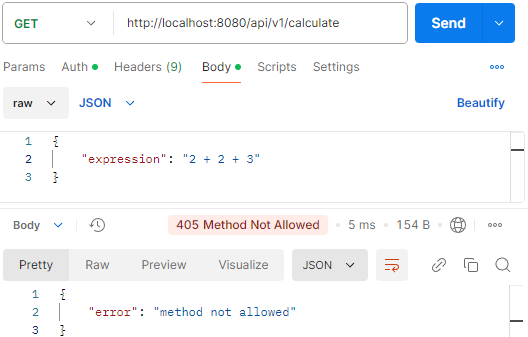

# Cacl service

## Описание проекта
<b>Calc service</b> — это проект, реализованный на языке программирования Golang, который предназначен для вычисления арифметических выражений, таких как "(6+(2+2)*2)/10". Главная цель этого сервиса заключается в том, чтобы предоставить возможность быстро и точно обрабатывать математические выражения, которые могут включать в себя различные операции, такие как сложение, вычитание, умножение и деление, а также выражения со скобками.

## Настройка
Клонируйте этот репозиторий:

```sh
git clone https://github.com/DobryySoul/yandex_repo.git
```

Мы почти готовы запустить сервис, но сначала нам нужно выполнить некоторые настройки конфигурации.

## Конфигурация
Сервис можно настроить с помощью переменных среды. Со списком и описанием доступных параметров к настройке можно ознакомиться [здесь](#Список-параметров-конфигурации). 

Чтобы указать параметр переменной среды, а именно порт, который вы хотите использовать, необходимо указать соответствующую переменную среды: `PORT`:
### Windows

```sh
$env:PORT=порт
```

### Linux и macOS

```sh
export PORT=порт
```

## Запуск сервера

После установки переменной среды, сервис может быть успешно запущен на указанном порту следующей командой в терминале:

```sh
go run ./cmd/main.go
```



Мои поздравления! Сервис был успешно запущен и готов к функционированию.

<strong>Примечание!!! Если вы не указали порт и запустили проект, то сервис будет запущен на default значении порта ":8080".</strong>

## Список параметров конфигурации

#### `port`

*(номер)* Порт для запуска приложения.

Эквивалент Env: `PORT`.

## Обработка запросов и ошибок

### Статус коды
В зависимости от типа запроса, а также корректности выражения, сервер дает различные ответы, с соответствующими статус кодами:

- `200`: Ответ на успешный запрос вида `{"expression": "аримфметическое выражение верного формата"}`
  


- `405`: Ответ на иной тип запроса, кроме POST
  


- `422`: Ошибка в арифметическом выражении, например: `{"expression": "2 + 2 * (2 * 3"}`, более подробно с ошибками, которые могут возникать с выражениями вы можете ознакамливаться в логах или по ссылке в [файле с ошибками](pkg/calculation/errors.messages.go)


 
- `500`: Случай внутренней ошибки сервера. Данная ошибка не возникает, так как сервер работает полностью исправно, но все же данная ошибка должна обрабатываться, на случай, когда сервер не сможет обработать запрос к сайту.
 